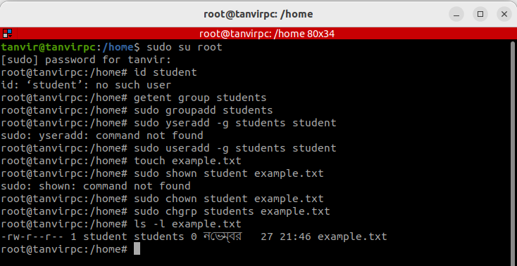
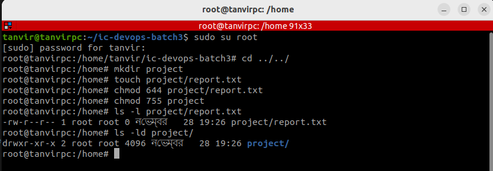

## File System Navigation
   1. List the contents of the home directory.
   2. Change the current directory to /var/log and list its contents.
   3. Find and display the path to the bash executable using the which command.
   4. Find current shell

### 1. List the contents of the home directory

Run the following command to list the contents of the home directory:

        ls ~

The ~ symbol represents the home directory for the current user. 

### 2. Change the current directory to /var/log and list its contents

            cd /var/log

Then list its contents:
            ls

For a detailed view of files (e.g., permissions, sizes, and dates), use:

            ls -l

### 3. Find and display the path to the bash executable using the *which* command

            which bash

This will display the full path to the bash executable, usually */bin/bash*

### 4. Find the current shell

Run the following command to display current shell:

            echo $SHELL

This will output the path to the shell using, such as */bin/bash*

If we need to determine the shell process currently running, use:

        ps -p $$

The output will show the name of the shell process, e.g., bash or zsh.

## File and Directory Operations

    1. Create a directory named linux_fundamentals in your home directory. 
    2. Inside linux_fundamentals, create a subdirectory named scripts. 
    3. Create an empty file named example.txt inside the linux_fundamentals directory. 
    4. Copy example.txt to the scripts directory. 
    5. Move example.txt from linux_fundamentals to linux_fundamentals/backup. 
    6. Change the permissions of example.txt to read and write for the owner, and      read-only for the group and others. 
    7. Verify the permission changes using ls -l

### 1. Create a directory named *linux_fundamentals*

        mkdir linux_fundamentals

### 2. Inside linux_fundamentals, create a subdirectory named *scripts*

        mkdir linux_fundamentals/scripts

### 3. Create an empty file named *example.txt* inside the *linux_fundamentals* directory

        touch linux_fundamentals/example.txt

### 4. Copy *example.txt* to the *scripts* directory

        cp linux_fundamentals/example.txt linux_fundamentals/scripts/

### 5. Move example.txt from linux_fundamentals to linux_fundamentals/backup

        1. First, create the backup directory:

            mkdir linux_fundamentals/backup

        2. First, create the backup directory:

            mv linux_fundamentals/example.txt linux_fundamentals/backup/

## Permissions

6. Change the permissions of *example.txt*

        chmod 644 linux_fundamentals/backup/example.txt

7. Verify the permission changes

        ls -l linux_fundamentals/backup/example.txt

#### Examples of Common Permissions

    Octal	Symbolic	Description
    777	    rwxrwxrwx	Everyone has full access.
    755	    rwxr-xr-x	Owner has full access, others can read/execute.
    644	    rw-r--r--	Owner can read/write, others can only read.
    700	    rwx------	Only the owner has full access.
    000	    ----------	No one has any access.

## File Modification

1. Create a file named example.txt in your home directory. 
2. Change the owner of example.txt to a user named student 
3. Change the group of example.txt to a group named students. 
4. Verify the changes using appropriate commands.

>- Check if the user exists:

        id student

>- Check if the group exists:

        getent group students

>- Create the user and group (if they do not exist):

    
        sudo groupadd students
        sudo useradd -g students student

### 1. Create a file named example.txt in your home directory

        touch example.txt

### 2. Change the owner of *example.txt* to a user named *student*

         sudo chown student example.txt

 >- Explanation:

    >- sudo: Grants administrative privileges required to change file ownership.

    >- chown student: Changes the owner of the file to student.

### 3. Change the group of *example.txt* to a group named *students*

        sudo chgrp students example.txt

>- Explanation:

    >- sudo: Grants administrative privileges required to change group ownership.

    >- chgrp students: Changes the group of the file to students.

### 4. Verify the changes using appropriate commands

        ls -l example.txt

## Ownership

 1. Create a directory named project in your home directory. 
 2. Create a file named report.txt inside the project directory. 
 3. Set the permissions of report.txt to read and write for the owner, and read-only for the group and others. 
 4. Set the permissions of the project directory to read, write, and execute for the owner, and read and execute for the group and others 
 5. Verify the changes using appropriate commands.

 ### Step 1: Create a directory named *project*.

        mkdir project

### Step 2: Create a file named *report.txt* inside the *project* directory.

        touch project/report.txt

### Step 3: Set the permissions of *report.txt* to read and write for the owner, and read-only for the group and others.

        chmod 644 project/report.txt

>- Explanation:

        >- 6 = Read + Write (Owner)
        >- 4 = Read-only (Group)
        >- 4 = Read-only (Others)

### Step 4: Set the permissions of the project directory to read, write, and execute for the owner, and read and execute for the group and others.

        chmod 755 project

>- Explanation:
        >- 7 = Read + Write + Execute (Owner)
        >- 5 = Read + Execute (Group)
        >- 5 = Read + Execute (Others)

### Step 5: Verify the changes using the following commands.

        >- Check permissions of report.txt:

                ls -l project/report.txt

        Check permissions of the project directory:

                ls -ld project

