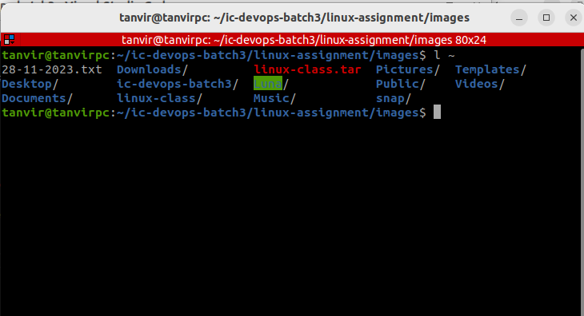
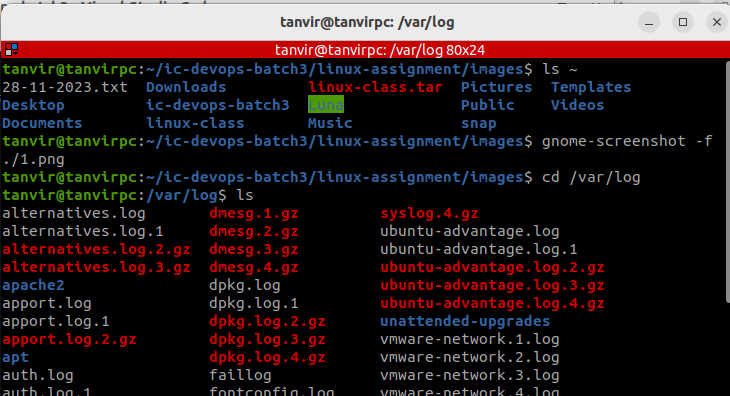
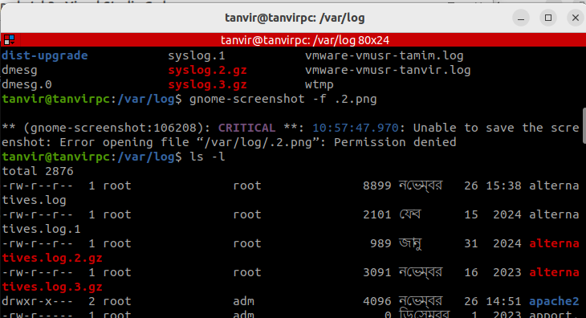
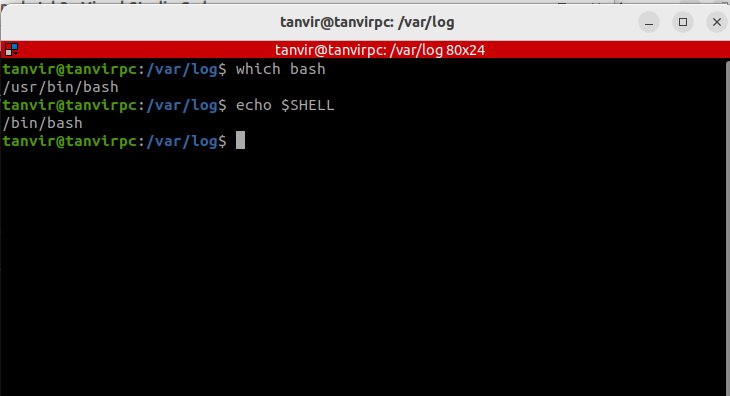
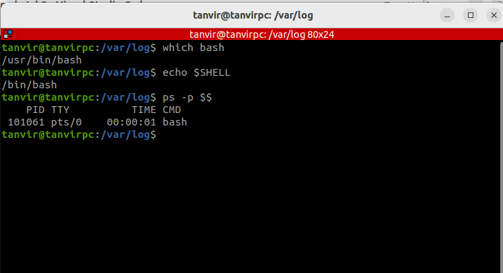
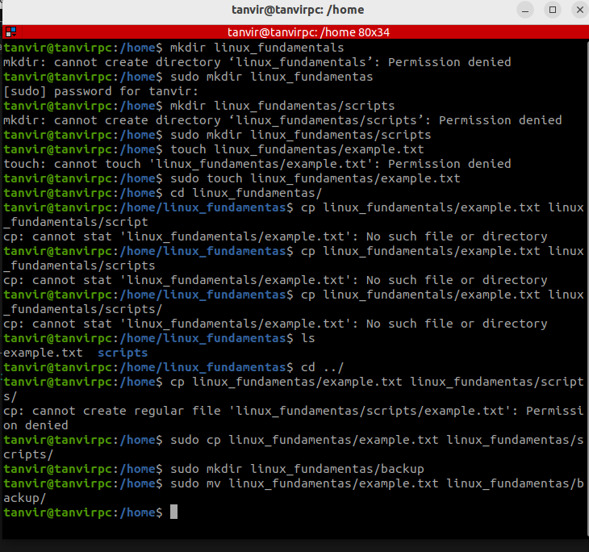
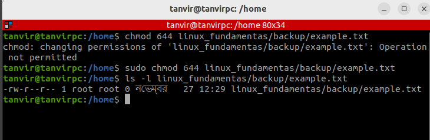

## File System Navigation
   1. List the contents of the home directory.
   2. Change the current directory to /var/log and list its contents.
   3. Find and display the path to the bash executable using the which command.
   4. Find current shell

### 1. List the contents of the home directory

Run the following command to list the contents of the home directory:

        ls ~

The ~ symbol represents the home directory for the current user. 

### 2. Change the current directory to /var/log and list its contents

            cd /var/log

Then list its contents:
            ls

For a detailed view of files (e.g., permissions, sizes, and dates), use:

            ls -l

### 3. Find and display the path to the bash executable using the *which* command

            which bash

This will display the full path to the bash executable, usually */bin/bash*

### 4. Find the current shell

Run the following command to display current shell:

            echo $SHELL

This will output the path to the shell using, such as */bin/bash*

If we need to determine the shell process currently running, use:

        ps -p $$

The output will show the name of the shell process, e.g., bash or zsh.

## File and Directory Operations

    1. Create a directory named linux_fundamentals in your home directory. 
    2. Inside linux_fundamentals, create a subdirectory named scripts. 
    3. Create an empty file named example.txt inside the linux_fundamentals directory. 
    4. Copy example.txt to the scripts directory. 
    5. Move example.txt from linux_fundamentals to linux_fundamentals/backup. 
    6. Change the permissions of example.txt to read and write for the owner, and      read-only for the group and others. 
    7. Verify the permission changes using ls -l

### 1. Create a directory named *linux_fundamentals*

        mkdir linux_fundamentals

### 2. Inside linux_fundamentals, create a subdirectory named *scripts*

        mkdir linux_fundamentals/scripts

### 3. Create an empty file named *example.txt* inside the *linux_fundamentals* directory

        touch linux_fundamentals/example.txt

### 4. Copy *example.txt* to the *scripts* directory

        cp linux_fundamentals/example.txt linux_fundamentals/scripts/

### 5. Move example.txt from linux_fundamentals to linux_fundamentals/backup

        1. First, create the backup directory:

            mkdir linux_fundamentals/backup

        2. First, create the backup directory:

            mv linux_fundamentals/example.txt linux_fundamentals/backup/

## Permissions

6. Change the permissions of *example.txt*

        chmod 644 linux_fundamentals/backup/example.txt

7. Verify the permission changes

        ls -l linux_fundamentals/backup/example.txt

#### Examples of Common Permissions

    Octal	Symbolic	Description
    777	    rwxrwxrwx	Everyone has full access.
    755	    rwxr-xr-x	Owner has full access, others can read/execute.
    644	    rw-r--r--	Owner can read/write, others can only read.
    700	    rwx------	Only the owner has full access.
    000	    ----------	No one has any access.

